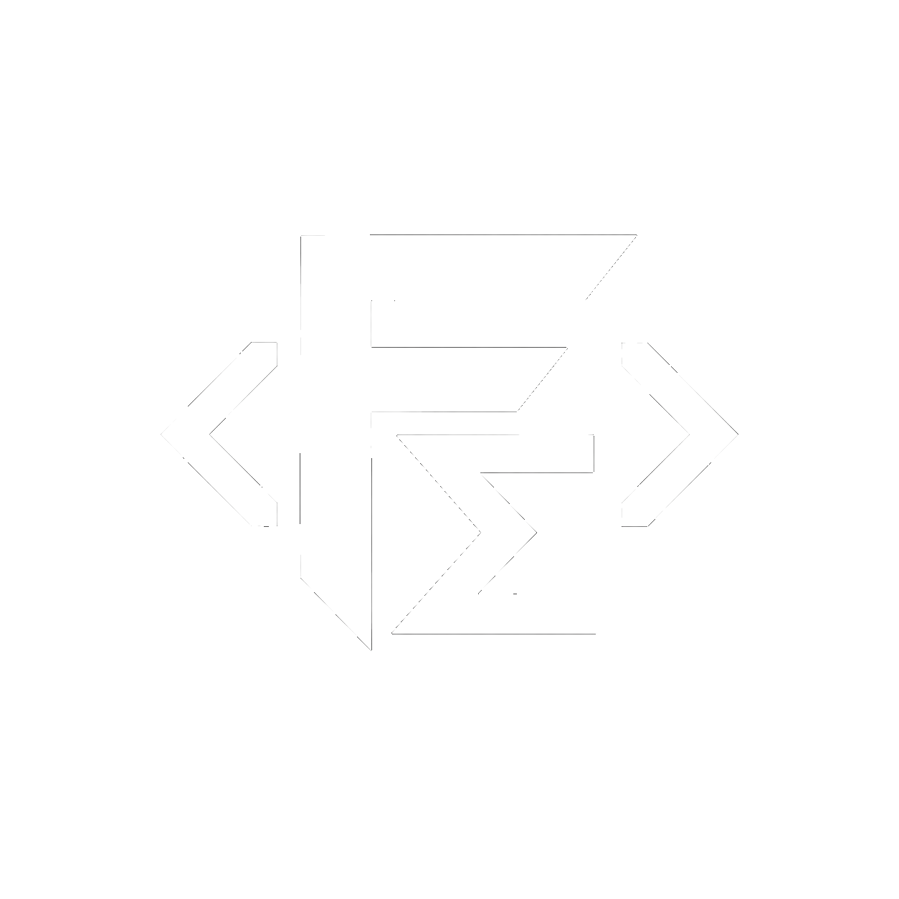

<h1 align="center">FormatMath - Luau Utility Module</h1>

<p align="center">
  <b>A lightweight Roblox Studio serializer for saving, exporting, and restoring Instance hierarchies.</b>
</p>

<p align="center">
  
  
  
</p>

<p align="center">
  
  
  
</p>

<p align="center">
  
  
  
</p>
<p align="center"></p>

---

## Overview

**FormatMath** is a small Luau utility module designed to keep common math and formatting operations in one place.

It includes utilities for:

* Basic math operations
* Number mapping and interpolation
* Percentages and rounding
* Prime numbers and factorials
* GCD and LCM
* Distance calculations
* Binary, hexadecimal, octal, and custom-base conversion
* Roman numerals
* Scientific notation
* ASCII conversion
* Binary and hexadecimal strings
* Base64 encoding and decoding
* Random utilities
* Number formatting
* String padding

The module is designed to be simple to drop into Roblox projects without requiring additional dependencies.

---

## Installation

Place `FormatMath.luau` inside your project and require it normally:

```lua
local FormatMath = require(path.To.FormatMath)
```

You can then use any of the available utilities:

```lua
local FormatMath = require(path.To.FormatMath)

print(FormatMath.Clamp(150, 0, 100))
print(FormatMath.Lerp(0, 100, 0.5))
print(FormatMath.ToHex(255))
print(FormatMath.ToRoman(2026))
```

---

## API

### Math

```lua
FormatMath.Clamp(value, min, max)
FormatMath.Lerp(a, b, t)
FormatMath.Round(value, places?)
FormatMath.Map(value, inMin, inMax, outMin, outMax)
FormatMath.Percent(value, total)
FormatMath.Factorial(n)
FormatMath.GCD(a, b)
FormatMath.LCM(a, b)
FormatMath.IsPrime(n)
FormatMath.Distance(x1, y1, x2, y2)
```

Example:

```lua
local health = FormatMath.Clamp(125, 0, 100)
local damage = FormatMath.Lerp(10, 50, 0.5)

print(health) -- 100
print(damage) -- 30
```

---

### Number Conversion

Supports bases from **2 to 36**.

```lua
FormatMath.ToBase(number, base)
FormatMath.FromBase(string, base)

FormatMath.ToBinary(number)
FormatMath.ToHex(number)
FormatMath.ToOctal(number)
```

Example:

```lua
print(FormatMath.ToBinary(255))
-- 11111111

print(FormatMath.ToHex(255))
-- FF

print(FormatMath.FromBase("FF", 16))
-- 255
```

---

### Roman Numerals

```lua
FormatMath.ToRoman(number)
```

Example:

```lua
print(FormatMath.ToRoman(2026))
-- MMXXVI
```

Values must be between `1` and `3999`.

---

### Scientific Notation

```lua
FormatMath.ToScientific(number)
```

Example:

```lua
print(FormatMath.ToScientific(1250000))
-- 1.250000e6
```

---

### ASCII

```lua
FormatMath.CharToASCII(character)
FormatMath.ASCIIToChar(code)

FormatMath.StringToASCII(text)
FormatMath.ASCIIToString(list)
```

Example:

```lua
local codes = FormatMath.StringToASCII("Hello")
print(codes)

print(FormatMath.ASCIIToString(codes))
-- Hello
```

---

### Binary Strings

```lua
FormatMath.StringToBinary(text)
FormatMath.BinaryToString(binary)
```

Example:

```lua
local binary = FormatMath.StringToBinary("Hello")

print(binary)
-- 01001000 01100101 01101100 01101100 01101111

print(FormatMath.BinaryToString(binary))
-- Hello
```

---

### Hex Strings

```lua
FormatMath.StringToHex(text)
FormatMath.HexToString(hex)
```

Example:

```lua
local hex = FormatMath.StringToHex("Hello")

print(hex)
-- 48 65 6C 6C 6F

print(FormatMath.HexToString(hex))
-- Hello
```

---

### Base64

```lua
FormatMath.Base64Encode(text)
FormatMath.Base64Decode(text)
```

Example:

```lua
local encoded = FormatMath.Base64Encode("Hello World")
local decoded = FormatMath.Base64Decode(encoded)

print(encoded)
print(decoded)
-- Hello World
```

---

### Random Utilities

```lua
FormatMath.RandomFloat(min, max)
FormatMath.RandomChoice(list)
```

Example:

```lua
local number = FormatMath.RandomFloat(1, 10)

local item = FormatMath.RandomChoice({
	"Sword",
	"Shield",
	"Potion"
})

print(number)
print(item)
```

---

### Formatting

```lua
FormatMath.Comma(number)

FormatMath.PadLeft(text, length, character?)
FormatMath.PadRight(text, length, character?)
```

Example:

```lua
print(FormatMath.Comma(1000000))
-- 1,000,000

print(FormatMath.PadLeft("42", 5))
-- 00042

print(FormatMath.PadRight("Hi", 5, "."))
-- Hi...
```

---

## Design

FormatMath intentionally keeps its API small and dependency-free.

The goal is not to replace Luau's built-in `math` or `string` libraries, but to provide commonly needed helpers that would otherwise be repeatedly implemented across projects.

```text
FormatMath
├── Math
├── Number Conversion
├── Roman Numerals
├── Scientific Notation
├── ASCII
├── Binary
├── Hex
├── Base64
├── Random
└── Formatting
```

---

## Requirements

* Roblox / Luau
* `--!strict` compatible (optional)
* No external dependencies

---

> [!NOTE]
> FormatMath is intended as a general-purpose utility module. Some functions operate on numeric values and strings within Luau's normal number and string limitations.

---

> [!IMPORTANT]
>
> ## Disclaimer
>
> This project is provided for development, educational, testing, and general utility purposes.
>
> Users are responsible for ensuring that their use of this module complies with applicable laws, platform rules, licenses, and the terms of services of any platform where it is used.
>
> The maintainers are not responsible for misuse or modifications made to the project by third parties.

---

## License

Distributed under the license included in this repository.

See [`LICENSE`](LICENSE) for more information.

---

<p align="center">
  <sub>FormatMath - Luau Utility Module</sub>
  <br>
  <sub>Built for Roblox development</sub>
</p>
